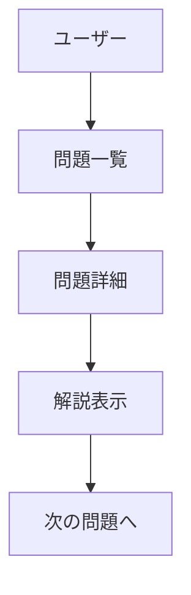

# ドキュメント運用ガイド

## 概要

AtCoder-NoviStepsプロジェクトのドキュメント戦略とメンテナンス方針

## ドキュメント構成

### 種別と目的

| 種別           | 目的             | 場所                    | 形式             |
| -------------- | ---------------- | ----------------------- | ---------------- |
| 開発ガイド     | 開発者向け指針   | `.github/instructions/` | Markdown         |
| ユーザーガイド | エンドユーザ向け | `/docs/`                | Markdown         |
| API仕様        | 外部連携         | 自動生成                | OpenAPI/Swagger  |
| 変更履歴       | リリース追跡     | `CHANGELOG.md`          | Keep a Changelog |
| README         | プロジェクト概要 | `README.md`             | GitHub標準       |

### AtCoder固有ドキュメント

- コンテスト問題データ構造
- AtCoder API連携仕様
- ユーザーレーティング算出ロジック
- 問題解説・ヒント執筆ガイド

## 執筆・更新フロー

### 原則

- 1 PR = 1 機能 + 関連ドキュメント更新
- 破壊的変更は明確に "BREAKING CHANGE" 表記
- スクリーンショットは圧縮済み画像使用

### レビュープロセス

- 技術精度: エンジニアレビュー
- 日本語表現: 必要に応じてライティングレビュー
- ユーザビリティ: 実際の利用者フィードバック

## Mermaid図活用

## メンテナンス

- 月1回のドキュメント棚卸し
- 古いスクリーンショット更新
- リンク切れチェック（CI組み込み推奨）

## 多言語対応（将来）

- 日本語メイン、英語サブ
- i18n用ディレクトリ構造準備
- 翻訳キー管理ツール検討
