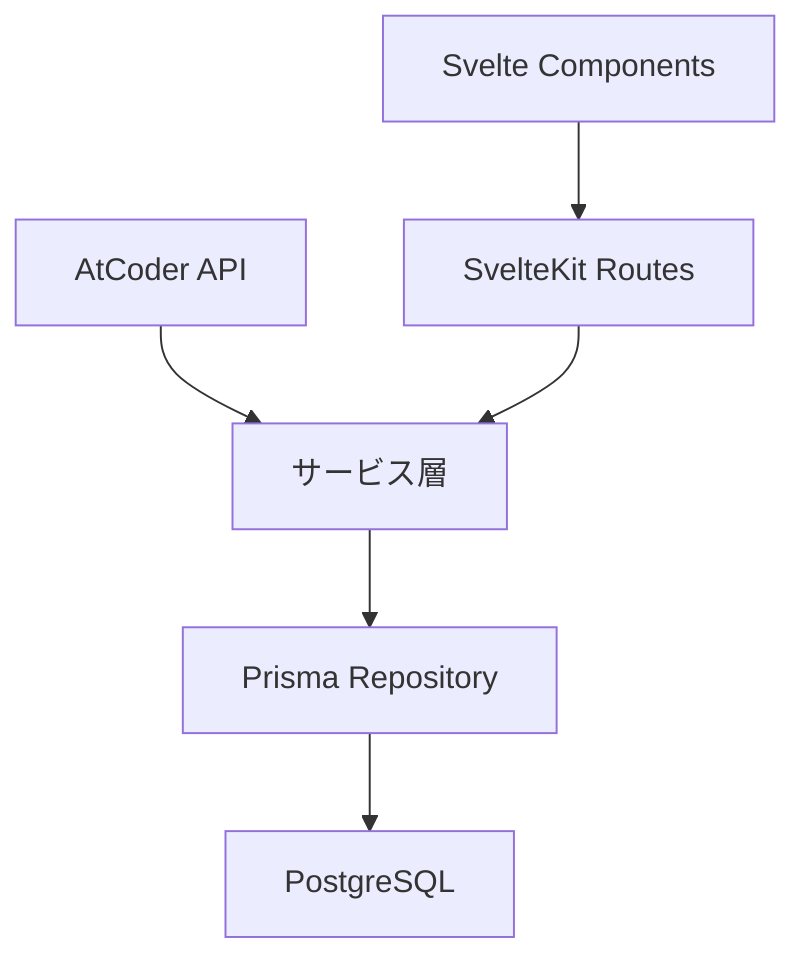

# ソースコード構成ガイド

## 概要

AtCoder-NoviStepsプロジェクトのソースコード構造とアーキテクチャ原則

## ディレクトリ構成

```
src/
├─ routes/                   # SvelteKit ページルーティング
│  ├─ +layout.svelte         # 全体レイアウト
│  ├─ +page.svelte           # トップページ
│  ├─ problems/              # 問題関連ページ
│  ├─ contests/              # コンテスト関連ページ
│  ├─ users/                 # ユーザー関連ページ
│  └─ api/                   # API エンドポイント
├─ lib/
│  ├─ components/            # 再利用UIコンポーネント
│  │  ├─ ui/                 # 基本UIパーツ (Button, Input等)
│  │  ├─ problem/            # 問題表示コンポーネント
│  │  ├─ contest/            # コンテスト関連コンポーネント
│  │  └─ user/               # ユーザー関連コンポーネント
│  ├─ server/                # サーバーサイドロジック
│  │  ├─ auth/               # Lucia認証関連
│  │  ├─ db/                 # データベースアクセス
│  │  ├─ atcoder/            # AtCoder API連携
│  │  └─ services/           # ビジネスロジック
│  ├─ stores/                # Svelte ストア
│  ├─ utils/                 # 共通ユーティリティ
│  ├─ types/                 # TypeScript型定義
│  └─ config/                # 設定ファイル
├─ app.html                  # HTMLテンプレート
├─ app.d.ts                  # アプリ型拡張
└─ hooks.server.ts           # サーバーフック
```

## AtCoder特化アーキテクチャ

### ドメインモデル

- **Problem**: 問題データ (ID, タイトル, 難易度, URL等)
- **Contest**: コンテスト情報 (開催日, 問題リスト等)
- **User**: ユーザー情報 (AtCoder ID, レーティング等)
- **Submission**: 提出履歴 (問題ID, 結果, 提出日時等)

### データフロー



## 命名規則

### ファイル・ディレクトリ

- ページ: `kebab-case` (`problem-list.svelte`)
- コンポーネント: `PascalCase` (`ProblemCard.svelte`)
- ユーティリティ: `camelCase` (`formatDifficulty.ts`)

### 変数・関数

- 変数: `camelCase` (`problemId`, `userRating`)
- 定数: `UPPER_SNAKE_CASE` (`ATCODER_BASE_URL`)
- 型: `PascalCase` (`Problem`, `ContestInfo`)
- インターフェース: `I` prefix (`IProblemRepository`)

## コンポーネント設計

### Atoms (基本UI)

```typescript
// lib/components/ui/Button.svelte
export interface ButtonProps {
  variant?: 'primary' | 'secondary' | 'danger';
  size?: 'sm' | 'md' | 'lg';
  disabled?: boolean;
}
```

### Molecules (機能UI)

```typescript
// lib/components/problem/ProblemCard.svelte
export interface ProblemCardProps {
  problem: Problem;
  showDifficulty?: boolean;
  showTags?: boolean;
}
```

### Organisms (ページ要素)

```typescript
// lib/components/problem/ProblemList.svelte
export interface ProblemListProps {
  problems: Problem[];
  filters?: ProblemFilters;
  pagination?: PaginationInfo;
}
```

## データアクセス層

### Repository パターン

```typescript
// lib/server/repositories/ProblemRepository.ts
export interface IProblemRepository {
  findById(id: string): Promise<Problem | null>;
  findByDifficulty(min: number, max: number): Promise<Problem[]>;
  search(query: string): Promise<Problem[]>;
}
```

### Service層

```typescript
// lib/server/services/ProblemService.ts
export class ProblemService {
  constructor(
    private problemRepo: IProblemRepository,
    private atcoderApi: IAtCoderApiClient,
  ) {}

  async syncProblemsFromAtCoder(): Promise<void> {
    // AtCoder APIからデータ取得→DB更新
  }
}
```

## 状態管理

### Svelte Store活用

```typescript
// lib/stores/problemStore.ts
import { writable } from 'svelte/store';

export const selectedProblems = writable<Problem[]>([]);
export const problemFilters = writable<ProblemFilters>({
  difficulty: { min: 0, max: 4000 },
  tags: [],
});
```

## API設計

### REST エンドポイント

```typescript
// src/routes/api/problems/+server.ts
export async function GET({ url }) {
  const difficulty = url.searchParams.get('difficulty');
  const tag = url.searchParams.get('tag');

  const problems = await problemService.getProblems({
    difficulty: difficulty ? parseInt(difficulty) : undefined,
    tag,
  });

  return json(problems);
}
```

## エラーハンドリング

### カスタムエラー

```typescript
// lib/types/errors.ts
export class AtCoderApiError extends Error {
  constructor(
    message: string,
    public statusCode: number,
  ) {
    super(message);
    this.name = 'AtCoderApiError';
  }
}
```

### エラー境界

```typescript
// src/routes/+error.svelte
<script>
  export let error;
</script>

{#if error.message.includes('AtCoder')}
  <p>AtCoder APIに接続できませんでした。しばらく待ってから再試行してください。</p>
{:else}
  <p>予期しないエラーが発生しました。</p>
{/if}
```

## パフォーマンス考慮

### レイジーローディング

```typescript
// 重いコンポーネントの遅延読み込み
import { onMount } from 'svelte';

let ProblemVisualization;
onMount(async () => {
  ProblemVisualization = (await import('./ProblemVisualization.svelte')).default;
});
```

### データキャッシュ

```typescript
// lib/server/cache/problemCache.ts
const CACHE_TTL = 60 * 60 * 1000; // 1時間

export class ProblemCache {
  private cache = new Map();

  async get(key: string): Promise<Problem[] | null> {
    const cached = this.cache.get(key);
    if (cached && Date.now() - cached.timestamp < CACHE_TTL) {
      return cached.data;
    }
    return null;
  }
}
```

## AtCoder連携特記事項

### API制限対応

- レート制限: 1秒間に10リクエスト以下
- キャッシュ必須: 問題データは1日1回更新で十分
- 失敗時リトライ: 指数バックオフ

### データ同期

- 増分更新: 新規問題のみ取得
- バッチ処理: 定期的な全データ同期
- 整合性チェック: データ欠損検出機能
