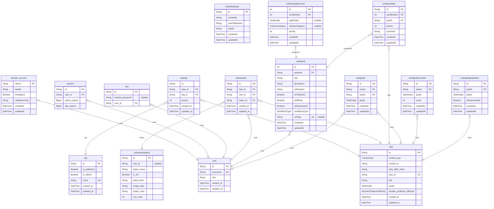

# AtCoder NoviSteps ERD
> Generated by [`prisma-markdown`](https://github.com/samchon/prisma-markdown)

- [default](#default)

## default

### `user`

**Properties**
  - `id`: 
  - `username`: 
  - `role`: 
  - `created_at`: 
  - `updated_at`: 

### `atcoder_account`

**Properties**
  - `userId`: 
  - `handle`: 
  - `isValidated`: 
  - `validationCode`: 
  - `createdAt`: 
  - `updatedAt`: 

### `session`

**Properties**
  - `id`: 
  - `user_id`: 
  - `active_expires`: 
  - `idle_expires`: 

### `key`

**Properties**
  - `id`: 
  - `hashed_password`: 
  - `user_id`: 

### `task`

**Properties**
  - `id`: 
  - `contest_type`: 
  - `contest_id`: 
  - `task_table_index`: 
  - `task_id`: 
  - `title`: 
  - `grade`: 
  - `atcoder_problems_difficulty`: 
  - `created_at`: 
  - `updated_at`: 

### `contesttaskpair`

**Properties**
  - `id`: 
  - `contestId`: 
  - `taskTableIndex`: 
  - `taskId`: 
  - `createdAt`: 
  - `updatedAt`: 

### `tag`

**Properties**
  - `id`: 
  - `is_published`: 
  - `is_official`: 
  - `name`: 
  - `created_at`: 
  - `updated_at`: 

### `tasktag`

**Properties**
  - `id`: 
  - `task_id`: 
  - `tag_id`: 
  - `priority`: 
  - `created_at`: 
  - `updated_at`: 

### `taskanswer`

**Properties**
  - `id`: 
  - `task_id`: 
  - `user_id`: 
  - `status_id`: 
  - `created_at`: 
  - `updated_at`: 

### `submissionstatus`

**Properties**
  - `id`: 
  - `user_id`: 
  - `status_name`: 
  - `is_AC`: 
  - `label_name`: 
  - `image_path`: 
  - `button_color`: 
  - `sort_order`: 

### `workbook`

**Properties**
  - `id`: 
  - `authorId`: 
  - `title`: 
  - `description`: 
  - `editorialUrl`: 
  - `isPublished`: 
  - `isOfficial`: 
  - `isReplenished`: 
  - `workBookType`: 
  - `urlSlug`: 
  - `createdAt`: 
  - `updatedAt`: 

### `workbookplacement`

**Properties**
  - `id`: 
  - `workBookId`: 
  - `taskGrade`: 
  - `solutionCategory`: 
  - `priority`: 
  - `createdAt`: 
  - `updatedAt`: 

### `workbooktask`

**Properties**
  - `id`: 
  - `workBookId`: 
  - `taskId`: 
  - `priority`: 
  - `comment`: 
  - `createdAt`: 
  - `updatedAt`: 

### `votegrade`

**Properties**
  - `id`: 
  - `userId`: 
  - `taskId`: 
  - `grade`: 
  - `createdAt`: 
  - `updatedAt`: 

### `votedgradecounter`

**Properties**
  - `id`: 
  - `taskId`: 
  - `grade`: 
  - `count`: 
  - `createdAt`: 
  - `updatedAt`: 

### `votedgradestatistics`

**Properties**
  - `id`: 
  - `taskId`: 
  - `grade`: 
  - `isExperimental`: 
  - `createdAt`: 
  - `updatedAt`: 