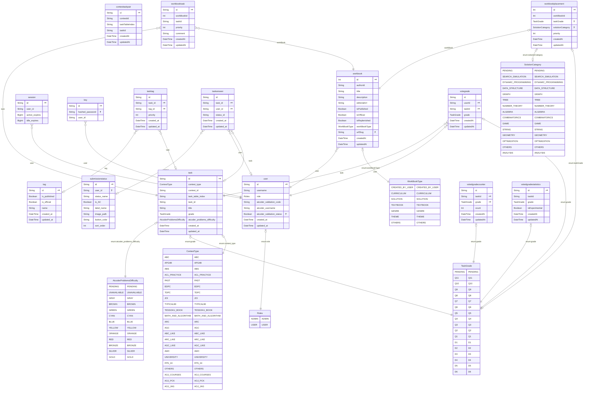

```mermaid
erDiagram

        Roles {
            ADMIN ADMIN
USER USER
        }
    


        ContestType {
            ABC ABC
APG4B APG4B
ABS ABS
ACL_PRACTICE ACL_PRACTICE
PAST PAST
EDPC EDPC
TDPC TDPC
JOI JOI
TYPICAL90 TYPICAL90
TESSOKU_BOOK TESSOKU_BOOK
MATH_AND_ALGORITHM MATH_AND_ALGORITHM
ARC ARC
AGC AGC
ABC_LIKE ABC_LIKE
ARC_LIKE ARC_LIKE
AGC_LIKE AGC_LIKE
AWC AWC
UNIVERSITY UNIVERSITY
FPS_24 FPS_24
OTHERS OTHERS
AOJ_COURSES AOJ_COURSES
AOJ_PCK AOJ_PCK
AOJ_JAG AOJ_JAG
        }
    


        TaskGrade {
            PENDING PENDING
Q11 Q11
Q10 Q10
Q9 Q9
Q8 Q8
Q7 Q7
Q6 Q6
Q5 Q5
Q4 Q4
Q3 Q3
Q2 Q2
Q1 Q1
D1 D1
D2 D2
D3 D3
D4 D4
D5 D5
D6 D6
        }
    


        AtcoderProblemsDifficulty {
            PENDING PENDING
UNAVAILABLE UNAVAILABLE
GRAY GRAY
BROWN BROWN
GREEN GREEN
CYAN CYAN
BLUE BLUE
YELLOW YELLOW
ORANGE ORANGE
RED RED
BRONZE BRONZE
SILVER SILVER
GOLD GOLD
        }
    


        WorkBookType {
            CREATED_BY_USER CREATED_BY_USER
CURRICULUM CURRICULUM
SOLUTION SOLUTION
TEXTBOOK TEXTBOOK
GENRE GENRE
THEME THEME
OTHERS OTHERS
        }
    


        SolutionCategory {
            PENDING PENDING
SEARCH_SIMULATION SEARCH_SIMULATION
DYNAMIC_PROGRAMMING DYNAMIC_PROGRAMMING
DATA_STRUCTURE DATA_STRUCTURE
GRAPH GRAPH
TREE TREE
NUMBER_THEORY NUMBER_THEORY
ALGEBRA ALGEBRA
COMBINATORICS COMBINATORICS
GAME GAME
STRING STRING
GEOMETRY GEOMETRY
OPTIMIZATION OPTIMIZATION
OTHERS OTHERS
ANALYSIS ANALYSIS
        }
    
  "user" {
    String id "🗝️"
    String username 
    Roles role 
    String atcoder_validation_code 
    String atcoder_username 
    Boolean atcoder_validation_status "❓"
    DateTime created_at 
    DateTime updated_at 
    }
  

  "session" {
    String id "🗝️"
    String user_id 
    BigInt active_expires 
    BigInt idle_expires 
    }
  

  "key" {
    String id "🗝️"
    String hashed_password "❓"
    String user_id 
    }
  

  "task" {
    String id "🗝️"
    ContestType contest_type 
    String contest_id 
    String task_table_index 
    String task_id 
    String title 
    TaskGrade grade 
    AtcoderProblemsDifficulty atcoder_problems_difficulty 
    DateTime created_at 
    DateTime updated_at 
    }
  

  "contesttaskpair" {
    String id "🗝️"
    String contestId 
    String taskTableIndex 
    String taskId 
    DateTime createdAt 
    DateTime updatedAt 
    }
  

  "tag" {
    String id "🗝️"
    Boolean is_published 
    Boolean is_official 
    String name 
    DateTime created_at 
    DateTime updated_at 
    }
  

  "tasktag" {
    String id 
    String task_id "🗝️"
    String tag_id "🗝️"
    Int priority 
    DateTime created_at 
    DateTime updated_at 
    }
  

  "taskanswer" {
    String id 
    String task_id "🗝️"
    String user_id "🗝️"
    String status_id 
    DateTime created_at 
    DateTime updated_at 
    }
  

  "submissionstatus" {
    String id "🗝️"
    String user_id "❓"
    String status_name 
    Boolean is_AC 
    String label_name 
    String image_path 
    String button_color 
    Int sort_order 
    }
  

  "workbook" {
    Int id "🗝️"
    String authorId 
    String title 
    String description 
    String editorialUrl 
    Boolean isPublished 
    Boolean isOfficial 
    Boolean isReplenished 
    WorkBookType workBookType 
    String urlSlug "❓"
    DateTime createdAt 
    DateTime updatedAt 
    }
  

  "workbookplacement" {
    Int id "🗝️"
    Int workBookId 
    TaskGrade taskGrade "❓"
    SolutionCategory solutionCategory "❓"
    Int priority 
    DateTime createdAt 
    DateTime updatedAt 
    }
  

  "workbooktask" {
    String id "🗝️"
    Int workBookId 
    String taskId 
    Int priority 
    String comment 
    DateTime createdAt 
    DateTime updatedAt 
    }
  

  "votegrade" {
    String id 
    String userId "🗝️"
    String taskId "🗝️"
    TaskGrade grade 
    DateTime createdAt 
    DateTime updatedAt 
    }
  

  "votedgradecounter" {
    String id 
    String taskId "🗝️"
    TaskGrade grade "🗝️"
    Int count 
    DateTime createdAt 
    DateTime updatedAt 
    }
  

  "votedgradestatistics" {
    String id "🗝️"
    String taskId 
    TaskGrade grade 
    Boolean isExperimental 
    DateTime createdAt 
    DateTime updatedAt 
    }
  
    "user" |o--|| "Roles" : "enum:role"
    "session" }o--|| user : "user"
    "key" }o--|| user : "user"
    "task" |o--|| "ContestType" : "enum:contest_type"
    "task" |o--|| "TaskGrade" : "enum:grade"
    "task" |o--|| "AtcoderProblemsDifficulty" : "enum:atcoder_problems_difficulty"
    "tasktag" }o--|o task : "task"
    "tasktag" }o--|o tag : "tag"
    "taskanswer" }o--|o task : "task"
    "taskanswer" }o--|o user : "user"
    "taskanswer" }o--|o submissionstatus : "status"
    "workbook" |o--|| "WorkBookType" : "enum:workBookType"
    "workbook" }o--|| user : "user"
    "workbookplacement" |o--|o "TaskGrade" : "enum:taskGrade"
    "workbookplacement" |o--|o "SolutionCategory" : "enum:solutionCategory"
    "workbookplacement" |o--|| workbook : "workBook"
    "workbooktask" }o--|| workbook : "workBook"
    "workbooktask" }o--|| task : "task"
    "votegrade" |o--|| "TaskGrade" : "enum:grade"
    "votegrade" }o--|| user : "user"
    "votegrade" }o--|| task : "task"
    "votedgradecounter" |o--|| "TaskGrade" : "enum:grade"
    "votedgradestatistics" |o--|| "TaskGrade" : "enum:grade"
```
